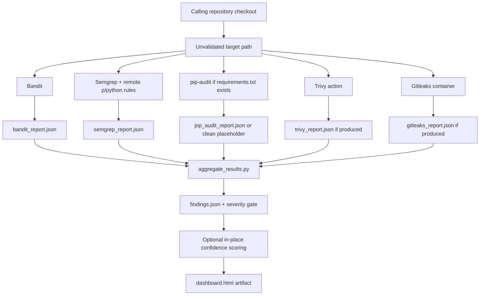
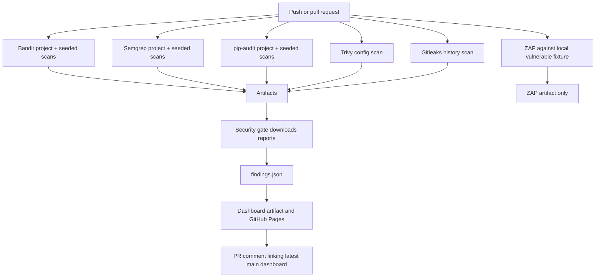
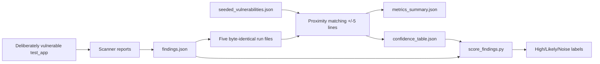
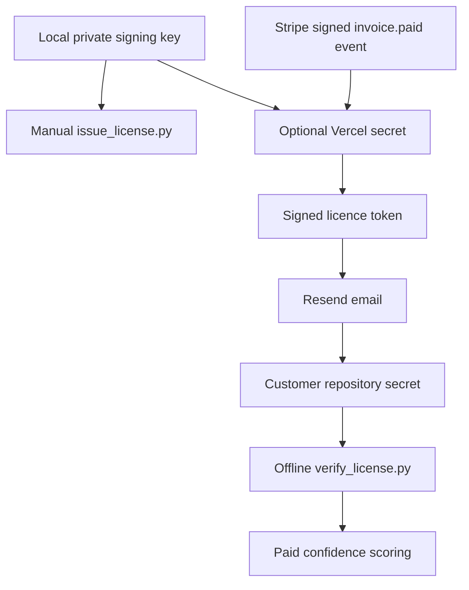
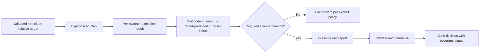

# Data Flow Audit

Audit date: 2026-07-24
Audited commit: `a780add`

## Trust boundaries

| Boundary | Untrusted input | Sensitive output or capability |
|---|---|---|
| Calling repository to composite Action | Source tree, filenames, `target`, `fail-on` | Scanner execution, Docker mount, report artefacts |
| Scanner process/container to aggregator | JSON reports and process exit status | Security decision |
| Aggregator to report renderer | Scanner-controlled text and paths | HTML dashboard and PR-visible content |
| Pull request to GitHub workflow | Untrusted code and repository metadata | Artifact and PR write permissions |
| Stripe to webhook | Signed webhook body and customer data | Licence creation |
| Webhook to Resend | Email, name, expiry, licence key | Customer email delivery |
| Local issuer to licence verifier | Private signing key / signed token | Paid feature authorization |
| Benchmark corpus to confidence engine | Labelled findings and ground truth | Confidence labels used for prioritisation |

## Composite Action product flow

All five scanners are launched best-effort. Their exit codes are suppressed, and
the aggregator does not receive execution metadata. It can only observe whether a
path exists, and currently interprets absence as an empty finding list.

### Product data elements

| Stage | Input | Output | Preservation |
|---|---|---|---|
| Scanners | Customer source/config/dependency files | Tool-native JSON | Written under `reports/`; not schema-validated |
| Aggregation | Five expected report paths | Simplified finding objects | Raw reports remain separate; many original fields are discarded |
| Gate | Simplified severity | Process exit code | Decision reason only printed to logs |
| Confidence | Finding tool/rule and generated table | Four confidence fields | `findings.json` overwritten by default |
| Dashboard | Findings and optional seeded fixture | Static HTML | Scanner text HTML-escaped |

## Repository dogfood workflow flow

The ZAP job is isolated from the gate: it is not a gate dependency, its report is
not downloaded, and the aggregator has no ZAP parser. The workflow therefore
documents a six-scanner flow but gates on, at most, five reports.

The workflow grants `pages: write`, `id-token: write`, and
`pull-requests: write` globally. Scanner jobs therefore receive permissions they
do not need. Job-local permissions exist only for Pages deployment and PR
commenting.

## Research and confidence flow

The five run files are identical, so they do not add independent evidence. The
confidence table uses only `run_1`. A scanner finding is labelled a true positive
when its line is within five lines of any seeded vulnerability, without requiring
matching file, CWE, vulnerability ID, symbol, source, or sink.

`generate_report.py` has a separate and still weaker detection calculation: a
seeded vulnerability is considered detected when any finding's tool name appears
in that vulnerability's expected-tool string. It then treats high-confidence
findings as true positives, noise-tier findings as false positives, and hard-codes
false negatives to zero. Those dashboard metrics are not valid benchmark
statistics.

## Licensing flow

The source code and findings are not uploaded to the licence service. The webhook
does transmit customer identity, email, plan, expiry, and the licence token to
Resend. The private signing key must be copied to Vercel for automated issuance.
The current design has expiry but no revocation database or key rotation process.

## Fail-open register

| ID | Location | Behaviour | Security impact | Required correction |
|---|---|---|---|---|
| FO-01 | `scripts/aggregate_results.py:42-43,60-61,78-79,97-98,125-126` | Missing report returns `[]` | Required scanner absence becomes clean | Model required report absence as `FAILED_SCANNER` |
| FO-02 | `action.yml:68,74,83,103-106` | Scanner commands use `|| true` or exit code zero | Crash and findings exit codes are indistinguishable | Capture each scanner's documented exit contract |
| FO-03 | `action.yml:90` | Trivy step continues on error | Missing/malformed Trivy output can be ignored | Validate report and apply configured failure policy |
| FO-04 | `.github/workflows/devsecops.yml:37,48,74,88,181,192,238-242` | CI scanner failures are suppressed | Dogfood gate can report clean after scanner failure | Use common execution wrapper |
| FO-05 | `.github/workflows/devsecops.yml:133-151` | ZAP failure is tolerated and missing report becomes `{"site":[]}` | Scanner failure is explicitly converted to clean data | Preserve failure state; never synthesize a clean report |
| FO-06 | `.github/workflows/devsecops.yml:211-217` | Trivy uses `@master` and `exit-code: 0` | Mutable scanner plus hidden execution failure | Pin and health-check |
| FO-07 | `.github/workflows/devsecops.yml:279-309` | Three report downloads and the gate step continue on error | Missing optional reports are not surfaced in the final decision | Make scanner requirement explicit in scan plan |
| FO-08 | `action.yml:81-86` | Missing `requirements.txt` creates an empty dependency report | Not-applicable and incomplete discovery are conflated | Emit `SKIPPED_NOT_APPLICABLE` with reason |
| FO-09 | `scripts/calculate_metrics.py:73-77` | Missing benchmark runs are skipped | Publication can proceed on incomplete evidence | Fail benchmark verification unless manifest requirements are met |
| FO-10 | `scripts/generate_report.py:33-36` | Missing seeded ground truth is silently accepted | Dashboard accuracy section can lose its evidence basis | Separate product report from benchmark report |
| FO-11 | `action.yml:128-145` | Licence failure falls back to free tier | Intended commercial fallback; safe only if raw security results remain unchanged | Preserve as explicit non-security health state |

FO-11 is not a false-clean security defect by itself. It is recorded because all
ignored failures must be explicit and because paid feature failure must never
corrupt security results.

## Error-handling register

- Malformed scanner JSON raises an uncaught exception. This fails aggregation,
  which is safer than a clean result, but no parser health state or actionable
  per-scanner message is produced.
- Unknown severities map to rank zero and cannot gate, even when the scanner
  severity vocabulary changed unexpectedly.
- Gitleaks output that is a valid JSON object rather than a list produces no
  findings without a parser error.
- Report schemas and scanner versions are not validated.
- Report timestamps are not checked, so a stale committed report can be consumed.
- Dashboard generation runs at module import and has no isolated error model.
- Webhook non-email invoice events return HTTP 200 with an error field when the
  customer email is missing, preventing a Stripe retry.

## Current security assumptions

1. Scanner reports are authentic, current, complete, and correspond to the
   checked-out commit.
2. Every scanner uses a stable output schema and severity vocabulary.
3. A missing report means no findings or not applicable.
4. The caller's `target` stays inside the workspace and is safe to pass to every
   scanner.
5. Docker is available and mounting the repository into Gitleaks is safe.
6. Remote Semgrep rules and mutable scanner images/actions remain benign.
7. GitHub artifact names do not collide and downloaded files are the expected
   reports.
8. Any unknown severity is below the gate threshold.
9. Line proximity is adequate ground truth.
10. A repeated deterministic scan is an independent statistical sample.
11. A local private key and Vercel secret are adequately protected without a
    rotation procedure.
12. Opening an HTML report may contact Google Fonts without violating privacy
    expectations.

These assumptions must be replaced with validation, explicit configuration, or
documented limitations.

## Target Phase 1 data-flow change

The immediate safe foundation should be:

The release decision must always carry both finding risk and security-coverage
health. Zero findings is meaningful only when every required scanner completed
and its expected report parsed successfully.

## Completion assessment

- [x] Current product, CI, research, reporting and licensing flows are documented.
- [x] Trust boundaries and data leaving the runner are documented.
- [x] Every identified fail-open path is registered.
- [x] Current security assumptions are explicit.
- [x] The first safe target flow is defined.
